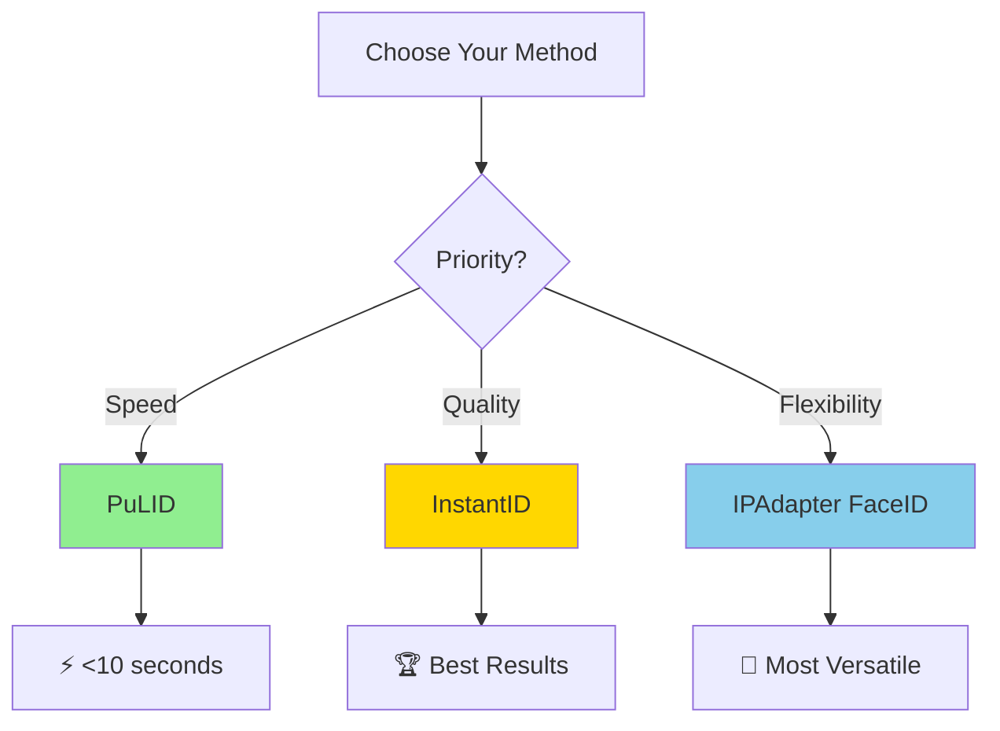

<div align="center">

# 🚀 AWESOME COMFYUI BEYOND

### *The Ultimate 2024-2025 ComfyUI Resource Collection*

[](https://awesome.re)


**From cutting-edge video generation to 3D creation, this is your comprehensive guide to the ComfyUI ecosystem.**

[🎬 Video Gen](#-video-generation-revolution) • [🎭 Face & Portrait](#-face--portrait-mastery) • [🎨 Image Magic](#-image-enhancement--effects) • [🏗️ 3D Creation](#%EF%B8%8F-3d-generation--depth) • [⚡ Setup](#-quick-start--essential-setup)

**Maintained by:** [umitkacar](https://github.com/umitkacar) | **Last Update:** November 2024

______________________________________________________________________

</div>

## 📑 Table of Contents

<details open>
<summary><b>🔍 Click to expand navigation</b></summary>

- [🌟 What's Hot in 2024-2025](#-whats-hot-in-2024-2025)
- [⚡ Quick Start & Essential Setup](#-quick-start--essential-setup)
- [🎬 Video Generation Revolution](#-video-generation-revolution)
- [🎭 Face & Portrait Mastery](#-face--portrait-mastery)
- [🎨 Image Enhancement & Effects](#-image-enhancement--effects)
- [🏗️ 3D Generation & Depth](#%EF%B8%8F-3d-generation--depth)
- [🔧 Workflow & Productivity](#-workflow--productivity-tools)
- [📦 Latest Models (2024-2025)](#-latest-models-2024-2025)
- [🎓 Learning Hub](#-learning-hub)
- [⭐ Community Favorites](#-community-favorites--top-repos)

</details>

______________________________________________________________________

## 🌟 What's Hot in 2024-2025

<div align="center">

### 🔥 Major Breakthroughs

</div>

| Category       | Innovation                     | Status                                                                   | Why It Matters                              |
| -------------- | ------------------------------ | ------------------------------------------------------------------------ | ------------------------------------------- |
| 🎬 **Video**   | **HunyuanVideo** (Tencent)     |            | 13B params, 5s videos, 8GB VRAM             |
| 🎬 **Video**   | **LTX Video** (Lightricks)     |          | First real-time DiT (faster than playback!) |
| 🎨 **Image**   | **Flux.1** (Black Forest Labs) |  | Revolutionary quality, day-1 support        |
| 🎭 **Face**    | **PuLID Flux II**              |           | Consistent faces, no model pollution        |
| 🏗️ **3D**      | **Trellis**                    |               | Unified 3D: Meshes, Gaussians, NeRF         |
| 🖼️ **Removal** | **BiRefNet**                   |              | Best background removal (CAAI AIR'24)       |
| 📏 **Depth**   | **DepthCrafter**               |          | Consistent long depth sequences             |

<div align="center">

### ⚙️ ComfyUI V1 Desktop (October 2024)


</div>

<table>
<tr>
<td width="25%" align="center">

### 📦 One-Click Install

No Python setup needed!

</td>
<td width="25%" align="center">

### 📚 Model Library

Drag & drop models

</td>
<td width="25%" align="center">

### 🔄 Auto Updates

Always stay current

</td>
<td width="25%" align="center">

### 🧩 600+ Nodes

Custom Node Registry

</td>
</tr>
</table>

**[⬇️ Download ComfyUI Desktop](https://www.comfy.org/download)**

______________________________________________________________________

## ⚡ Quick Start & Essential Setup

<div align="center">

### 🎯 First-Time Setup Guide


</div>

### 🛠️ Must-Have Extensions

<details open>
<summary><b>🔴 CRITICAL - Install First! (Click to collapse)</b></summary>

#### 1️⃣ ComfyUI Manager 

```
https://github.com/Comfy-Org/ComfyUI-Manager
```

✅ Install/update all custom nodes
✅ Automatic dependency resolution
✅ Model browser & downloader
✅ One-click missing node installation

#### 2️⃣ Workspace Manager 

```
https://github.com/11cafe/comfyui-workspace-manager
```

✅ Git-like version control for workflows
✅ Organize workflows, models & images
✅ Sync across multiple devices
✅ Workflow history & rollback

</details>

### 🎨 Core Custom Nodes

<table>
<tr>
<th width="33%">🖼️ Image Processing</th>
<th width="33%">⚡ Workflow Enhancement</th>
<th width="33%">🎛️ Control & Preprocessing</th>
</tr>
<tr>
<td valign="top">

**Impact Pack** 

```
github.com/ltdrdata/
ComfyUI-Impact-Pack
```

• Face detailing
• Segmentation
• Regional prompting

______________________________________________________________________

**IPAdapter Plus** 

```
github.com/cubiq/
ComfyUI_IPAdapter_plus
```

• 37 specialized nodes
• FaceID V2 support
• Style transfer

______________________________________________________________________

**ComfyUI Essentials**

```
github.com/cubiq/
ComfyUI_essentials
```

• Missing core features
• Quality-of-life fixes

</td>
<td valign="top">

**WAS Node Suite**

```
github.com/ltdrdata/
was-node-suite-comfyui
```

• 100+ essential nodes
• Image processing
• Prompt utilities

______________________________________________________________________

**Efficiency Nodes**

```
github.com/jags111/
efficiency-nodes-comfyui
```

• Streamlined workflows
• Reduced clutter

______________________________________________________________________

**rgthree-comfy**

```
github.com/rgthree/
rgthree-comfy
```

• Power Prompt
• Fast Groups
• Utilities

______________________________________________________________________

**Custom Scripts**

```
github.com/pythongosssss/
ComfyUI-Custom-Scripts
```

• UI/UX improvements

</td>
<td valign="top">

**ControlNet Aux** 

```
github.com/Fannovel16/
comfyui_controlnet_aux
```

• 65+ preprocessors
• All control types

______________________________________________________________________

**Portrait Master**

```
github.com/florestefano1975/
comfyui-portrait-master
```

• Advanced portrait control
• Professional results

</td>
</tr>
</table>

______________________________________________________________________

## 🎬 Video Generation Revolution

<div align="center">

### 🏆 State-of-the-Art Models (2024-2025)


</div>

### 🔥 Top Performers Comparison

| Model               | Best For                | Params | VRAM  | Speed      | Quality    |
| ------------------- | ----------------------- | ------ | ----- | ---------- | ---------- |
| 🥇 **HunyuanVideo** | Professional Production | 13B    | 8GB+  | ⭐⭐⭐     | ⭐⭐⭐⭐⭐ |
| 🥈 **LTX Video**    | Real-time Generation    | 13B    | 16GB+ | ⭐⭐⭐⭐⭐ | ⭐⭐⭐⭐   |
| 🥉 **Mochi**        | Text-to-Video Quality   | 10B    | 20GB  | ⭐⭐       | ⭐⭐⭐⭐⭐ |
| 🎯 **CogVideoX**    | Image-to-Video          | -      | 14GB  | ⭐⭐⭐     | ⭐⭐⭐⭐   |

<details open>
<summary><b>🔴 HunyuanVideo (Tencent) - CVPR 2025 Highlight</b></summary>


**Repository:** https://github.com/kijai/ComfyUI-HunyuanVideoWrapper

#### 🎯 Key Features

- ✨ 13B parameters, DiT architecture
- ✨ Generate 5-second videos (extendable)
- ✨ Native ComfyUI support (December 2024)
- ✨ Custom 3D VAE compression

#### ⚙️ Requirements

- **Minimum VRAM:** 8GB
- **Recommended:** 16GB+
- **Best Quality:** 24GB+

#### 🎬 Use Cases

```
✓ Professional video production
✓ Marketing content
✓ Social media videos
✓ Product demonstrations
```

</details>

<details>
<summary><b>🟠 LTX Video (Lightricks) - Real-Time Generation</b></summary>


**Repository:** https://github.com/Lightricks/ComfyUI-LTXVideo

#### 🎯 Key Features

- 🚀 **FIRST** real-time DiT video model
- 🚀 Generate at 24FPS (768x512)
- 🚀 Faster than playback speed!
- 🚀 Supports up to 60 seconds

#### 📦 Model Variants

| Model        | Steps    | Speed  | Quality  |
| ------------ | -------- | ------ | -------- |
| Standard 13B | Normal   | Fast   | ⭐⭐⭐⭐ |
| Distilled    | 4-8 only | ⚡⚡⚡ | ⭐⭐⭐⭐ |

#### ⚙️ Requirements

- **VRAM:** 16GB+
- **Quantized versions available** for 4090/5090

</details>

<details>
<summary><b>🟡 Mochi (Genmo) - Best Text-to-Video Quality</b></summary>


**Repository:**

- https://github.com/kijai/ComfyUI-MochiWrapper
- https://github.com/logtd/ComfyUI-MochiEdit (Video editing)

#### 🎯 Key Features

- 🎨 10B parameters
- 🎨 Best text-to-video quality
- 🎨 Video editing capabilities
- 🎨 AsymmDiT architecture

#### ⚙️ Requirements

- **VRAM:** 20GB (minimum)
- **Originally:** 4x H100 (100GB) - huge optimization!

</details>

<details>
<summary><b>🔵 CogVideoX (Tsinghua University) - Best I2V</b></summary>


**Repository:** https://github.com/kijai/ComfyUI-CogVideoXWrapper

#### 🎯 Key Features

- 📸 Best image-to-video quality
- 📸 Chinese prompt optimization
- 📸 3D VAE + Expert Transformer
- 📸 Efficient memory usage

#### ⚙️ VRAM Usage

- **Sampling:** 5-6GB
- **VAE Decode:** 13-14GB (peak)
- **With offloading:** Works on 8GB cards

</details>

### 🛠️ Video Tools & Utilities

| Tool                                                                              | Purpose                       | Stars                                                                                              |
| --------------------------------------------------------------------------------- | ----------------------------- | -------------------------------------------------------------------------------------------------- |
| [VideoHelperSuite](https://github.com/Kosinkadink/ComfyUI-VideoHelperSuite)       | Essential video processing    |     |
| [AnimateDiff-Evolved](https://github.com/Kosinkadink/ComfyUI-AnimateDiff-Evolved) | Advanced AnimateDiff features |  |
| [LivePortraitKJ](https://github.com/kijai/ComfyUI-LivePortraitKJ)                 | Live portrait animation       |             |

______________________________________________________________________

## 🎭 Face & Portrait Mastery

<div align="center">

### 🎯 Face Swapping Technology Comparison

</div>



<table>
<tr>
<th width="33%">🥇 PuLID</th>
<th width="33%">🥈 InstantID</th>
<th width="33%">🥉 IPAdapter FaceID V2</th>
</tr>
<tr>
<td valign="top">


**Best for:** Lightning-fast results

```
github.com/cubiq/
PuLID_ComfyUI
```

**✨ Features:**

- Tuning-free ID customization
- PuLID Flux II (no pollution)
- Generate in \<10 seconds
- Good quality/speed balance

**⚡ Speed:** ⭐⭐⭐⭐⭐
**🎨 Quality:** ⭐⭐⭐⭐
**💾 VRAM:** ⭐⭐⭐⭐

</td>
<td valign="top">


**Best for:** Maximum quality

```
github.com/cubiq/
ComfyUI_InstantID
```

```
github.com/nosiu/
comfyui-instantId-faceswap
```

**✨ Features:**

- Highest quality results
- Combine with FaceDetailer
- - IP-Adapter for best results
- SDXL only

**⚡ Speed:** ⭐⭐⭐
**🎨 Quality:** ⭐⭐⭐⭐⭐
**💾 VRAM:** ⭐⭐

</td>
<td valign="top">


**Best for:** Integration needs

```
github.com/cubiq/
ComfyUI_IPAdapter_plus
```

**✨ Features:**

- Kolors FaceIDv2 (Aug 2024)
- Weight: -1 to 5.0
- Requires InsightFace + LoRA
- Very flexible

**⚡ Speed:** ⭐⭐⭐⭐
**🎨 Quality:** ⭐⭐⭐⭐
**💾 VRAM:** ⭐⭐⭐

</td>
</tr>
</table>

### 🌟 Face Enhancement Tools

| Tool                                                              | Purpose      | Key Feature               |
| ----------------------------------------------------------------- | ------------ | ------------------------- |
| 🎨 [Impact Pack](https://github.com/ltdrdata/ComfyUI-Impact-Pack) | FaceDetailer | Automatic face refinement |
| 🔄 [ReActor](https://github.com/Gourieff/comfyui-reactor-node)    | Face Swap    | Easy face swapping        |
| 🎭 [FaceFusion](https://github.com/facefusion/facefusion)         | Standalone   | Professional face fusion  |

______________________________________________________________________

## 🎨 Image Enhancement & Effects

<div align="center">

### 🏆 Best-in-Class Tools (2024)

</div>

### 🖼️ Background Removal - BiRefNet


<table>
<tr>
<td width="50%">

**Original Implementation:**

```
github.com/ZhengPeng7/BiRefNet
```

**Multi-Model Integration:**

```
github.com/1038lab/ComfyUI-RMBG
```

</td>
<td width="50%">

**🎯 Why BiRefNet?**

- 🏆 Best hair detail preservation
- 🏆 Multiple model variants
- 🏆 Commercially usable
- 🏆 2024 SOTA performance

</td>
</tr>
</table>

#### 📦 Model Variants

| Model    | Resolution | Use Case        |
| -------- | ---------- | --------------- |
| General  | Standard   | Everyday use    |
| HR       | 2048x2048  | High resolution |
| Lite     | Fast       | Speed priority  |
| Portrait | Optimized  | Human portraits |

______________________________________________________________________

### 📈 Upscaling Solutions

<table>
<tr>
<th width="50%">🥇 SUPIR - Professional Grade</th>
<th width="50%">🥈 AuraSR - GAN Power</th>
</tr>
<tr>
<td valign="top">


```
github.com/kijai/ComfyUI-SUPIR
```

**💎 Features:**

- Comparable to Magnific, Topaz
- Works on 8GB VRAM
- Two model variants

**📦 Models:**

- **SUPIR-v0Q:** Maximum quality
- **SUPIR-v0F:** Detail preservation

**⭐ Rating:**

- Quality: ⭐⭐⭐⭐⭐
- Speed: ⭐⭐⭐
- VRAM: ⭐⭐⭐⭐

</td>
<td valign="top">


```
github.com/alexisrolland/
AuraSR-ComfyUI
```

**💎 Features:**

- GigaGAN architecture
- RGBA transparency support
- Advanced detail enhancement

**⚠️ Note:**
Sensitive to image compression

**⭐ Rating:**

- Quality: ⭐⭐⭐⭐
- Speed: ⭐⭐⭐⭐
- VRAM: ⭐⭐⭐

</td>
</tr>
</table>

______________________________________________________________________

### 💡 IC-Light - Professional Relighting


<table>
<tr>
<td width="50%">

**Implementations:**

```
github.com/kijai/ComfyUI-IC-Light
```

```
github.com/huchenlei/
ComfyUI-IC-Light-Native
```

</td>
<td width="50%">

**🎬 Capabilities:**

- ✨ Text-conditioned relighting
- ✨ Background-conditioned
- ✨ Video relighting support
- ✨ Professional results

</td>
</tr>
</table>

#### 📜 Licensing

| Version | License    | Commercial Use         |
| ------- | ---------- | ---------------------- |
| V1      | Open       | ✅ Allowed             |
| V2      | Restricted | ❌ Non-commercial only |

______________________________________________________________________

### 🎨 Advanced Inpainting

<details>
<summary><b>PowerPaint V2 + BrushNet (2024)</b></summary>


**Repository:** https://github.com/nullquant/ComfyUI-BrushNet

#### 🎯 Features

- 🖌️ BrushNet + PowerPaint integration
- 🖌️ Object removal with SAM
- 🖌️ Convert any SD 1.5 to inpainting model
- 🖌️ Multiple inpainting modes

</details>

<details>
<summary><b>ControlNet Union - Unified Control (2024)</b></summary>


#### For Flux

```
github.com/XLabs-AI/x-flux-comfyui
```

**7 Control Modes:** canny, tile, depth, blur, pose, gray, low quality

#### For SDXL

**Includes ALL control types in ONE model!**

- ✅ Massive storage savings
- ✅ Promax: +Tile Variation, Deblur, Super-resolution

</details>

______________________________________________________________________

### 📏 Depth Estimation

<div align="center">

### DepthCrafter


</div>

**Repository:** https://github.com/akatz-ai/ComfyUI-DepthCrafter-Nodes

**🎯 Revolutionary Features:**

- 🎬 Consistent long depth sequences
- 🎬 No optical flow needed
- 🎬 No camera pose required
- 🎬 Video editing & post-production

**⚙️ Configurable Parameters:**

- Window size: 75-110 (recommended)
- Overlap for longer videos
- CPU offload saves +25% VRAM

______________________________________________________________________

## 🏗️ 3D Generation & Depth

<div align="center">

### Trellis - Unified 3D Asset Generation


</div>

<table>
<tr>
<td width="50%">

**Repositories:**

```
github.com/if-ai/
ComfyUI-IF_Trellis
```

```
github.com/smthemex/
ComfyUI_TRELLIS
```

</td>
<td width="50%">

**🎯 Output Formats:**

- 🏗️ Radiance Fields
- 🏗️ 3D Gaussians
- 🏗️ Meshes

**📥 Input:** Text or Image prompts

</td>
</tr>
</table>

### 🔬 Technology

**SLAT Representation** (Structured 3D Latents)

- Unified format for all 3D types
- Editable 3D assets
- Scalable & versatile

### ⚙️ Requirements

- **Minimum VRAM:** 8GB
- **Recommended:** 16GB+

### 🛠️ Additional 3D Tools

| Tool                                                               | Purpose                                  |
| ------------------------------------------------------------------ | ---------------------------------------- |
| [ComfyUI-3D-Pack](https://github.com/MrForExample/ComfyUI-3D-Pack) | Comprehensive 3D processing (3DGS, NeRF) |
| [Apple ml-4m](https://github.com/apple/ml-4m)                      | Multimodal model research                |

______________________________________________________________________

## 🔧 Workflow & Productivity Tools

### ⚡ Essential Utilities

<table>
<tr>
<th>🖥️ Monitoring</th>
<th>⚙️ Optimization</th>
<th>✍️ Prompting</th>
</tr>
<tr>
<td valign="top">

**Crystools**

```
github.com/crystian/
ComfyUI-Crystools
```

Real-time monitoring:

- 📊 CPU usage
- 📊 GPU usage
- 📊 Memory stats

</td>
<td valign="top">

**Use Everywhere**

```
github.com/chrisgoringe/
cg-use-everywhere
```

- 🔌 Cleaner workflows
- 🔌 Better organization

**Masquerade**

```
github.com/BadCafeCode/
masquerade-nodes-comfyui
```

- 🎭 Advanced masking

</td>
<td valign="top">

**SDXL Prompt Styler**

```
github.com/ZHO-ZHO-ZHO/
ComfyUI-SDXL-Prompt-Styler
```

- 📝 Pre-set styles

**WD14 Tagger**

```
github.com/pythongosssss/
ComfyUI-WD14-Tagger
```

- 🏷️ Image → Prompts

</td>
</tr>
</table>

______________________________________________________________________

## 📦 Latest Models (2024-2025)

### 🔥 Flux.1 (Black Forest Labs) - August 2024


**Built-in Nodes:** `FluxGuidance`, `ModelSamplingFlux`

<table>
<tr>
<td width="50%">

#### Flux.1 Dev


[📥 Download](https://huggingface.co/black-forest-labs/FLUX.1-dev)

**Features:**

- High-quality guidance-distilled
- Best for quality results

</td>
<td width="50%">

#### Flux.1 Schnell


[📥 Download](https://huggingface.co/black-forest-labs/FLUX.1-schnell)

**Features:**

- Fast "Turbo" model
- 4-8 steps only

</td>
</tr>
</table>

**Extensions:**

- [x-flux-comfyui](https://github.com/XLabs-AI/x-flux-comfyui) - LoRA & ControlNet integration

______________________________________________________________________

### 🌈 Stable Diffusion 3 / 3.5 (2024)


| Model            | Release   | Download                                                                      |
| ---------------- | --------- | ----------------------------------------------------------------------------- |
| **SD3 Medium**   | June 2024 | [📥 Download](https://huggingface.co/stabilityai/stable-diffusion-3-medium)   |
| **SD3.5 Large**  | Oct 2024  | [📥 Download](https://huggingface.co/stabilityai/stable-diffusion-3.5-large)  |
| **SD3.5 Medium** | Oct 2024  | [📥 Download](https://huggingface.co/stabilityai/stable-diffusion-3.5-medium) |

______________________________________________________________________

### 🎌 Kolors (Kuaishou) - July 2024


**Repository:** https://github.com/Kwai-Kolors/Kolors
**ComfyUI:** https://github.com/MinusZoneAI/ComfyUI-Kolors-MZ

**🌟 Features:**

- Bilingual excellence (Chinese & English)
- Trained on billions of text-image pairs
- KlingAI project creators

______________________________________________________________________

<details>
<summary><b>📦 Classic Models (SDXL, SD 1.5, SD 2.x) - Click to expand</b></summary>

### SDXL Models

| Model                    | Download                                                                                                            |
| ------------------------ | ------------------------------------------------------------------------------------------------------------------- |
| SDXL Base                | [📥](https://huggingface.co/stabilityai/stable-diffusion-xl-base-1.0/resolve/main/sd_xl_base_1.0.safetensors)       |
| SDXL Refiner             | [📥](https://huggingface.co/stabilityai/stable-diffusion-xl-refiner-1.0/resolve/main/sd_xl_refiner_1.0.safetensors) |
| DreamShaper Lightning XL | [📥](https://huggingface.co/Lykon/dreamshaper-xl-lightning/resolve/main/DreamShaperXL_Lightning.safetensors)        |
| SDXL Turbo               | [📥](https://huggingface.co/stabilityai/sdxl-turbo/resolve/main/sdxl-turbo.safetensors)                             |

### SD 1.5 & 2.x Models

| Model        | Download                                                                                                        |
| ------------ | --------------------------------------------------------------------------------------------------------------- |
| SD v1.5      | [📥](https://huggingface.co/runwayml/stable-diffusion-v1-5/resolve/main/v1-5-pruned-emaonly.ckpt)               |
| SD 2.1 (512) | [📥](https://huggingface.co/stabilityai/stable-diffusion-2-1-base/resolve/main/v2-1_512-ema-pruned.safetensors) |
| SD 2.1 (768) | [📥](https://huggingface.co/stabilityai/stable-diffusion-2-1/resolve/main/v2-1_768-ema-pruned.safetensors)      |

</details>

______________________________________________________________________

## 🎓 Learning Hub

### 📚 Official Documentation

<table>
<tr>
<td width="25%" align="center">

### 📖 Docs

[Official Guide](https://docs.comfy.org/get_started/introduction)

2024 Updated

</td>
<td width="25%" align="center">

### 📝 Blog

[ComfyUI Blog](https://blog.comfy.org)

Latest news

</td>
<td width="25%" align="center">

### 🎯 Examples

[Official Workflows](https://github.com/comfyanonymous/ComfyUI_examples)

Learn by doing

</td>
<td width="25%" align="center">

### 🎨 Templates

[Built-in Templates](https://github.com/Comfy-Org/workflow_templates)

Ready to use

</td>
</tr>
</table>

______________________________________________________________________

### 🎬 Video Tutorials & Courses

| Resource                                                             | Type     | Level             | Cost |
| -------------------------------------------------------------------- | -------- | ----------------- | ---- |
| [Olivio Sarikas](https://www.youtube.com/@OlivioSarikas/playlists)   | YouTube  | All levels        | Free |
| [ThinkDiffusion](https://learn.thinkdiffusion.com)                   | Platform | Beginner-Advanced | Free |
| [FastCampus](https://fastcampus.com/en/products/data_online_comfyui) | Course   | Comprehensive     | $215 |

______________________________________________________________________

### 🌐 Community Platforms

| Platform                                                    | Workflows   | Features            |
| ----------------------------------------------------------- | ----------- | ------------------- |
| [OpenArt Academy](https://openart.ai/workflows/academy)     | Educational | Structured learning |
| [OpenArt Templates](https://openart.ai/workflows/templates) | 1000+       | Searchable          |
| [ComfyWorkflows](https://comfyworkflows.com)                | Community   | Sharing platform    |
| [RunComfy](https://www.runcomfy.com/comfyui-workflows)      | 200+        | Curated             |

______________________________________________________________________

### ☁️ Cloud Platforms

<table>
<tr>
<th width="50%">🌥️ Comflowy</th>
<th width="50%">⚡ RunComfy</th>
</tr>
<tr>
<td valign="top">

**Features:**

- ✅ No setup required
- ✅ 100+ extensions pre-installed
- ✅ Cloud & local models
- ✅ Closed-source model access

[Visit Comflowy](https://www.comflowy.com)

</td>
<td valign="top">

**Features:**

- ✅ Pre-configured nodes
- ✅ Pre-loaded models
- ✅ 200+ workflows ready
- ✅ Fast deployment

[Visit RunComfy](https://www.runcomfy.com)

</td>
</tr>
</table>

______________________________________________________________________

## ⭐ Community Favorites & Top Repos

### 🏆 Most Starred (2024)

| Rank | Repository                                                                            | Stars                                                                                                 | Description                             |
| ---- | ------------------------------------------------------------------------------------- | ----------------------------------------------------------------------------------------------------- | --------------------------------------- |
| 🥇   | [ZHO's Workflows](https://github.com/ZHO-ZHO-ZHO/ComfyUI-Workflows-ZHO)               |           | Comprehensive Chinese/English workflows |
| 🥈   | [HunyuanVideoWrapper](https://github.com/kijai/ComfyUI-HunyuanVideoWrapper)           |           | Latest video generation                 |
| 🥉   | [AdvancedLivePortrait](https://github.com/PowerHouseMan/ComfyUI-AdvancedLivePortrait) |  | Advanced portrait animation             |

### 🔍 Essential Resources

| Resource                                                               | Purpose                           |
| ---------------------------------------------------------------------- | --------------------------------- |
| [Top 100 ComfyUI](https://github.com/liusida/top-100-comfyui)          | Auto-updated ranking of top repos |
| [Awesome ComfyUI](https://github.com/ComfyUI-Workflow/awesome-comfyui) | Curated node collection           |

______________________________________________________________________

### 🎭 Specialized Extensions

<details>
<summary><b>🤖 Vision & Language Models</b></summary>

- [Florence-2](https://github.com/spacepxl/ComfyUI-Florence-2) - Microsoft's vision model
- [Florence2 Alt](https://github.com/kijai/ComfyUI-Florence2) - Alternative implementation
- [IF_AI_tools](https://github.com/if-ai/ComfyUI-IF_AI_tools) - LLM integration
- [VLM nodes](https://github.com/gokayfem/ComfyUI_VLM_nodes) - Vision Language Models

</details>

<details>
<summary><b>✂️ Segmentation & Detection</b></summary>

- [Segment Anything](https://github.com/storyicon/comfyui_segment_anything) - SAM integration
- [Depth Anything V2](https://github.com/DepthAnything/Depth-Anything-V2) - Latest depth estimation

</details>

<details>
<summary><b>🎬 Animation & Motion</b></summary>

- [AnimateDiff](https://github.com/ArtVentureX/comfyui-animatediff) - Animation generation
- [DragDiffusion](https://github.com/Yujun-Shi/DragDiffusion) - Interactive editing
- [MusePose](https://github.com/TMElyralab/Comfyui-MusePose) - Pose-driven animation
- [MimicMotion](https://github.com/tencent/MimicMotion) - Motion transfer
- [Hallo](https://github.com/AIFSH/ComfyUI-Hallo) - Portrait animation

</details>

<details>
<summary><b>🔧 Utilities & Integration</b></summary>

- [Tooling Nodes](https://github.com/Acly/comfyui-tooling-nodes) - Professional tools
- [Inpaint Nodes](https://github.com/Acly/comfyui-inpaint-nodes) - Advanced inpainting
- [API Tools](https://github.com/BadCafeCode/apitools-comfyui) - API integration
- [Blender Integration](https://github.com/AIGODLIKE/ComfyUI-BlenderAI-node) - 3D workflow
- [Krita Integration](https://github.com/Acly/krita-ai-diffusion) - Painting software
- [Enhanced Sidebar](https://github.com/Nuked88/ComfyUI-N-Sidebar) - UI improvement

</details>

______________________________________________________________________

## 🤝 Contributing

<div align="center">

### Help Make This Resource Better!


</div>

**How to contribute:**

1. 🍴 Fork this repository
1. ➕ Add your resource to appropriate section
1. 📝 Include brief, clear description
1. ✅ Verify links work
1. 🚀 Create pull request

**Guidelines:**

- ✅ ComfyUI-related only
- ✅ 2024-2025 content preferred
- ✅ Working links required
- ✅ Clear descriptions
- ✅ Proper categorization

______________________________________________________________________

## 📝 Important Notes

### 💾 Model Downloads

**Requirements may include:**

- Hugging Face account + license agreement
- Civitai account
- Sufficient disk space (10-100GB per model)
- VRAM as specified

⚠️ **Always check system requirements before downloading!**

______________________________________________________________________

### 📜 Commercial Use Licensing

<table>
<tr>
<th>✅ Commercial Friendly</th>
<th>⚠️ Non-Commercial Only</th>
</tr>
<tr>
<td valign="top">

- Flux.1 (Dev & Schnell)
- Kolors
- SDXL
- BiRefNet
- IC-Light V1

</td>
<td valign="top">

- IC-Light V2
- DepthCrafter
- Some research models

**Always verify license!**

</td>
</tr>
</table>

______________________________________________________________________

## 🔗 More Awesome Resources

- [ComfyUI Official](https://github.com/comfyanonymous/ComfyUI) - The original project
- [ComfyUI Manager](https://github.com/ltdrdata/ComfyUI-Manager) - Official registry
- [Awesome ComfyUI](https://github.com/lucianosb/awesome-comfyui) - Another great list
- [ComfyUI Workflows](https://github.com/ComfyUI-Workflow/awesome-comfyui) - Workflow focused

______________________________________________________________________

<div align="center">

## 💡 Quick Start Checklist

**New to ComfyUI? Follow this path:**

```
✅ 1. Download ComfyUI Desktop V1
✅ 2. Install ComfyUI Manager
✅ 3. Watch Olivio Sarikas tutorials
✅ 4. Try official example workflows
✅ 5. Explore OpenArt templates
✅ 6. Join the community!
```

______________________________________________________________________

## ⭐ Star History

**If this helped you, please star this repo!**

[](https://github.com/umitkacar/Awesome-ComfyUI-Beyond)

**It helps others discover these resources.**

______________________________________________________________________

### 📊 Repository Stats


______________________________________________________________________

**This is a living document.** ComfyUI evolves rapidly - this list is continuously updated with cutting-edge developments.

**Questions? Ideas? Contributions?**
Open an issue or submit a pull request!

**Maintained with ❤️ by [umitkacar](https://github.com/umitkacar)**

*Last Update: November 2024*

</div>
